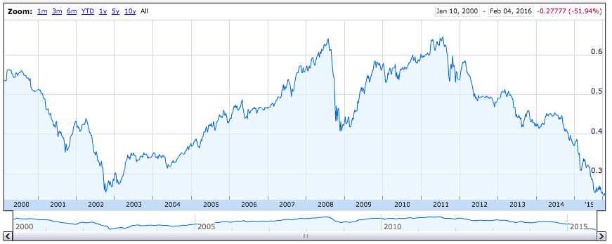

## Brazilian economy is crap now
I like this course a lot, with this I manage to create the first Brazilian Robo Advisor.

We invest in three different classes of fixed income:
- Postfixed (it pays around 14.25%)
- Prefixed (ten year bond: 16%)
- Inflation (7% over inflation, wich is around 10%)

And two different equity markets
- S&P 500 (broadly and know index)
- Brazilian top 50 company (-85% in USD since 2007)

---

## But we have been there before

Brazilian economy thrives when the currency is undervaluated. Their workforce got very cheap, their once 6th biggest economy infrastructure got idle and availabe for a very low price. Around 100% of population got in school since the 90s.

BRL is on the lowest right now.



---

## Compare treasuries series

Okay, this is a crappy app, no proud of it.
But it will be a nice way to look to durations and convexities of brazilian fixed income

```{r, echo=FALSE, fig.width=14, warning=FALSE}
source('../api.R')
ids <- c("ltn20180101", "ntnb20200815", "lft20210301")
data <- get_all_asset_dailies(ids)
g <- plot_treasury(data)
print(g)
```

It was fun, see you in the Capstone Project

---

## This is Sao Paulo, brazilian biggest city.


