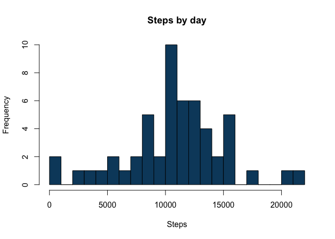
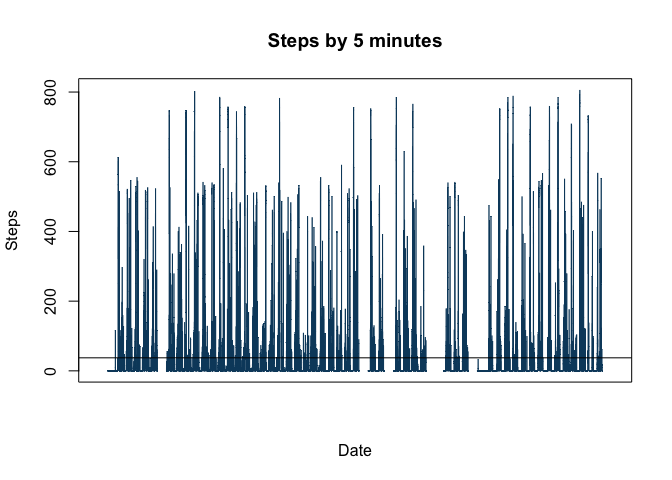
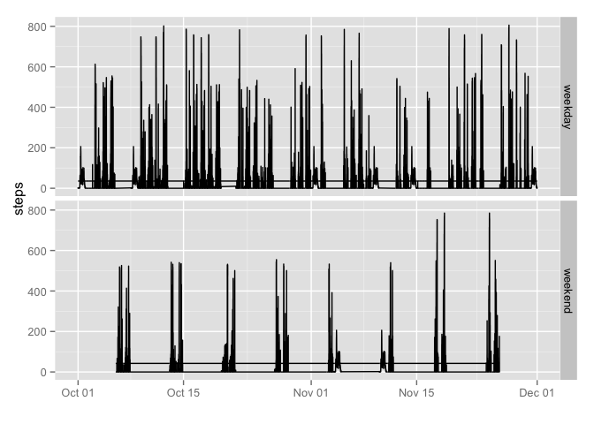

# Reproducible Research: Peer Assessment 1

## Loading and preprocessing the data

```r
library(ggplot2)
unzip('activity.zip')
data <- read.csv('activity.csv')
dailyData <- aggregate(steps ~ date, data, sum)
dateString <- paste(as.character(data$date), sprintf("%04d", data$interval))
data$fullDate <- as.POSIXlt(dateString, format="%Y-%m-%d %H%M")
data$date <- as.Date(data$date)
```

## What is mean total number of steps taken per day?

```r
hist(dailyData$steps,
     breaks=20,
     main="Steps by day",
     xlab="Steps",
     ylab="Frequency",
     col='#0B486B')
```

 

```r
mean(dailyData$steps, na.rm=TRUE)
```

```
## [1] 10766.19
```

```r
median(dailyData$steps, na.rm=TRUE)
```

```
## [1] 10765
```

## What is the average daily activity pattern?

```r
plot(data$steps,
     type="l",
     main="Steps by 5 minutes",
     xlab="Date",
     ylab="Steps",     
     col='#0B486B',
     xaxt="n")
abline(h=mean(data$steps, na.rm=TRUE))
```

 

```r
data[which(data$steps==max(data$steps, na.rm=T)), ]
```

```
##       steps       date interval            fullDate
## 16492   806 2012-11-27      615 2012-11-27 06:15:00
```

## Imputing missing values

```r
sum(is.na(data$steps))
```

```
## [1] 2304
```

```r
fData <- data # Filled data
meanStepsMin <- aggregate(steps ~ interval, fData, mean)
missingData <- is.na(fData$steps)
fData$steps[missingData] <- sapply(fData$interval[missingData], function(d) {
    meanStepsMin$steps[meanStepsMin$interval == d]
})
hist(dailyData$steps,
     breaks=20,
     main="Steps by day - filled data",
     xlab="Steps",
     ylab="Frequency",
     col='#0B486B')
```

 

```r
mean(dailyData$steps, na.rm=TRUE)
```

```
## [1] 10766.19
```

```r
median(dailyData$steps, na.rm=TRUE)
```

```
## [1] 10765
```


## Are there differences in activity patterns between weekdays and weekends?

```r
fData$weekday <- sapply(fData$date, function(d) {
    w <- weekdays(d)
    if (w == 'Saturday' || w == 'Sunday') {
        'weekend'
    }
    else {
        'weekday'
    }
})
fData$weekday <- factor(fData$weekday)
ggplot(fData, aes(fullDate, steps)) + geom_line() + facet_grid(weekday ~ .) +
    geom_line(stat = "hline", yintercept = "mean") + xlab("")
```

```
## Warning: Removed 12 rows containing missing values (geom_path).
```

```
## Warning: Removed 1 rows containing missing values (geom_path).
```

 

##### I got some trouble to handle NAs date because o daylight saving time in my country.
##### [https://class.coursera.org/repdata-010/forum/thread?thread_id=81].
